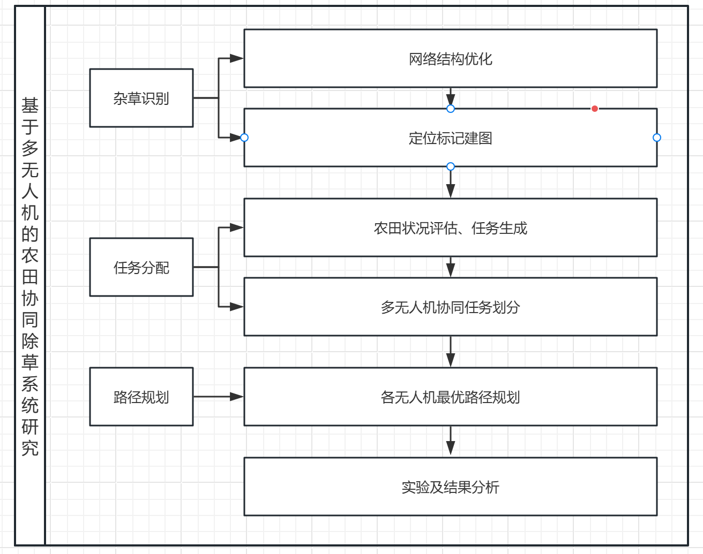

# 选题依据

## 选题来源

## 选题目的及意义

## 国内外研究动态

### 国内

### 国外

# 研究

## 目标与内容

建立一个多无人机协同的农田除草系统，包括无人机航拍时的杂草识别和定位标记，多无人机协同任务分配，和无人机最优

- 勘探无人机，全田勘探，精准识别杂草并标记
- 除草无人机组，自动根据标记协调分配任务并规划合理路径

## 方法与技术路线

- 通过文献调研和实验分析的方法进行研究
- 

## 拟解决的关键问题

- 无人机航拍时有目标尺度小分辨率低的特点
- 如何确保识别到的杂草在系统中被精确定位
- 多无人机任务如何合理分配
- 怎样规划路径可以使得无人机更加节能高效

# 学位论文

## 研究特色与创新之处

- 使用多无人机协同，大幅提升工作效率。
- 使用特化的识别算法提高了识别率。
- 使用了节能优化的路径规划算法更加低碳环保。

## 预期目标与预期研究成果

- 完成对航拍图像中杂草的精确识别，准确率在80%以上。
- 完成对多无人机工作的协同调度，保证工作效率。
- 完成高效的路径规划，确保考虑节能环保等多项因素。

## 研究进度安排

- 2024.12~2025.2 文献查询
- 2025.3~2025.6 杂草识别算法研究
- 2025.7~2025.10 多无人机任务分配方法研究
- 2025.11~2026.1 无人机田间高效路径规划算法研究
- 2026.2~2026.4 系统整合及实验
- 2026.5~2026.6 论文撰写

## 框架、研究计划

- 第一章 绪论
  - 1.1研究背景及意义
  - 1.2国内外研究现状
    - 1.2.1国内
    - 1.2.2国外
  - 1.3本文研究内容
- 第二章 杂草识别
  - 2.1网络结构
  - 2.2损失函数
- 第三章 任务分配
  - 3.1
- 第四章 路径规划
  - 4.1
- 第五章 实验研究
  - 5.1数据集
- 第六章 结论

# 文献综述

不低于30篇 GB/T7714-2015

## 引言

学位论文研究的主要方向、历史渊源、目前现状、存在问题及展望等

## 正文

一般要叙述研究课题的主要内容，在某阶段的发展历史，已解决的问题和尚存在的问题，对当前工作的现状，今后的发展趋势应作重点、详尽而具体地叙述

## 结论

结论部分一般除研究所得的结论外，还概括指出研究建议，存在的不同意见和拟解决的问题等

## 附录

